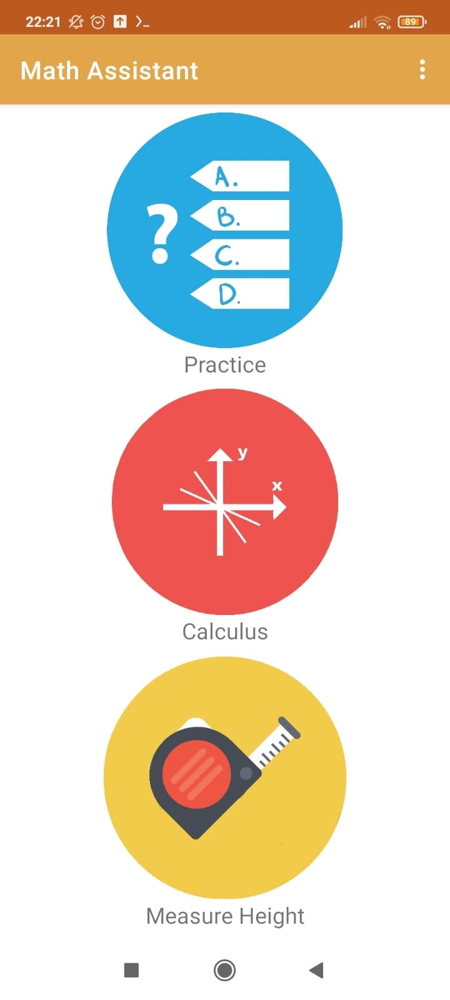
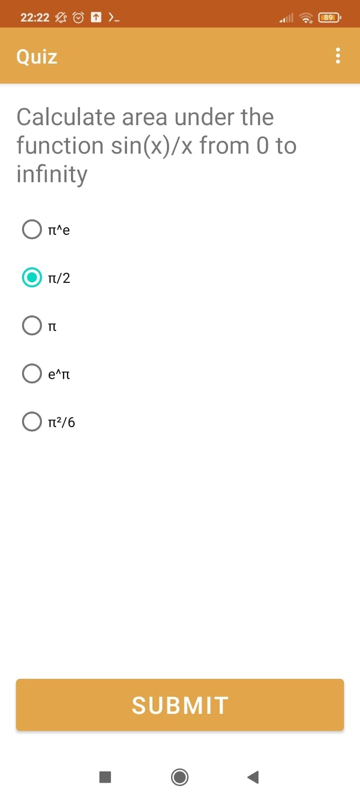
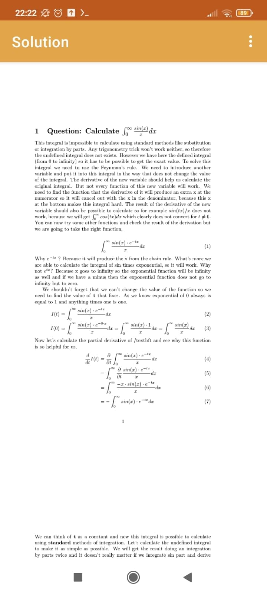
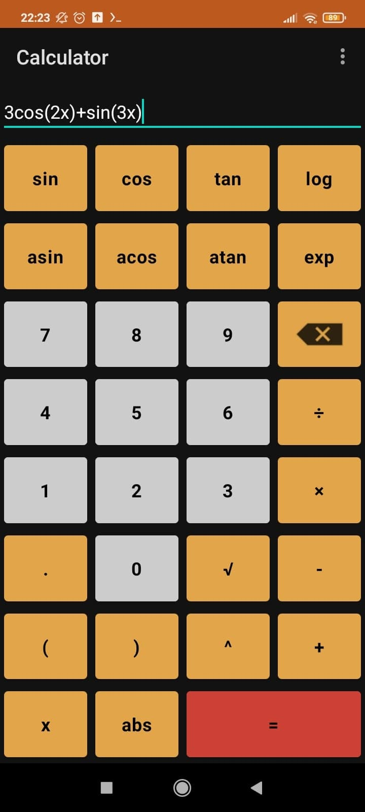
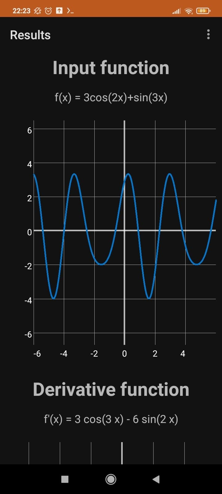
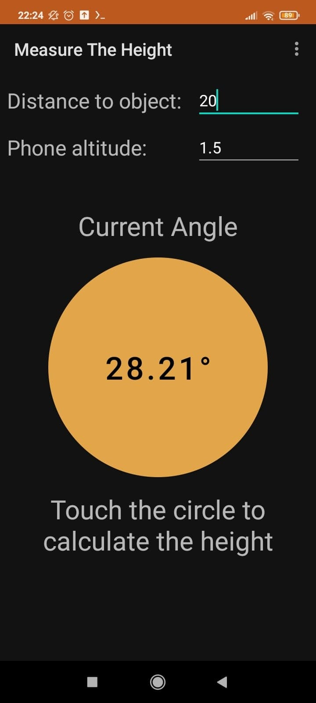

# MathAssistant
App for calculus students to practice and check different math problems.

# App contains:
+ Quiz system
+ pdf with solutions to all questions
+ complex math calculator (derivation and integration using Newton API)
+ plots of every possible input functions
+ Height measuring system (how it works 
+ Landscape and portrait layout of each activity
+ dark mode and auto dark mode (using light sensor)

# Screenshots

